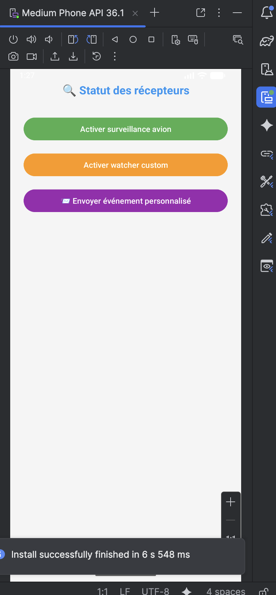
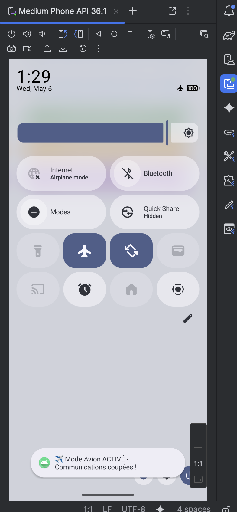
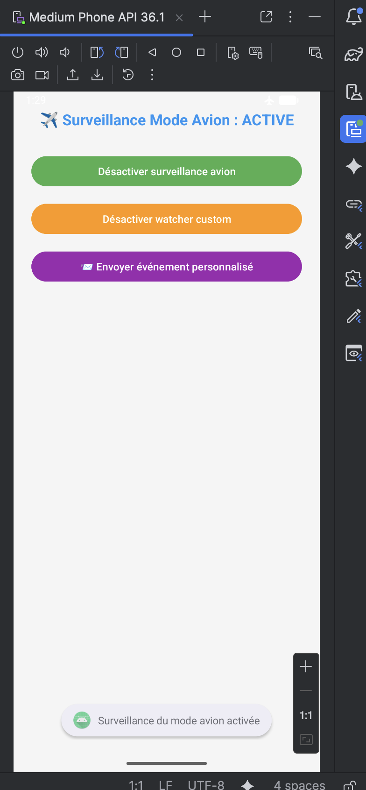
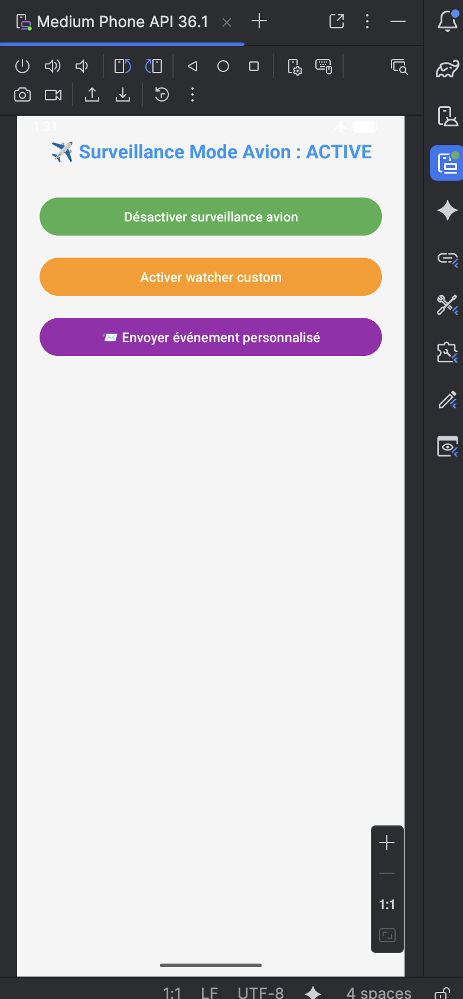

# LAB 17 – BroadcastReceiver : Maîtriser les événements système et personnalisés 📡

## Aperçu de l'application

Une application Android complète permettant de comprendre et maîtriser les BroadcastReceivers. L'application surveille le mode avion, écoute le démarrage du système et gère des événements personnalisés. Elle illustre la différence entre les récepteurs statiques et dynamiques.

| Écran initial | Activation mode avion | Désactivation surveillance avion |
|---------------|----------------------|----------------------------------|
|  |  |  |

| Désactivation watcher custom | Envoi événement personnalisé |
|------------------------------|------------------------------|
|  |  |

## Fonctionnalités

- **Surveillance mode avion (dynamique)** : détection automatique de l'activation/désactivation du mode avion avec affichage Toast
- **Watcher événements personnalisés** : réception et affichage de broadcasts personnalisés intra-application
- **Écoute démarrage système (statique)** : notification automatique au redémarrage de l'appareil
- **Interface interactive** : trois boutons pour contrôler les récepteurs dynamiques et envoyer des événements

## Architecture du projet

```
lab17_dev/
├── app/src/main/
│   ├── java/com/example/lab17_dev/
│   │   ├── MainActivity.java              (Activité principale)
│   │   ├── FlightModeMonitor.java         (Receiver mode avion)
│   │   ├── StartupListener.java           (Receiver démarrage)
│   │   └── CustomEventWatcher.java        (Receiver personnalisé)
│   ├── res/layout/
│   │   └── activity_main.xml              (Interface utilisateur)
│   └── AndroidManifest.xml                (Déclarations et permissions)
```

## Code source complet

### 1. Récepteur mode avion – `FlightModeMonitor.java`

```java
package com.example.lab17_dev;

import android.content.BroadcastReceiver;
import android.content.Context;
import android.content.Intent;
import android.widget.Toast;

public class FlightModeMonitor extends BroadcastReceiver {

    @Override
    public void onReceive(Context appContext, Intent incomingIntent) {
        if (Intent.ACTION_AIRPLANE_MODE_CHANGED.equals(incomingIntent.getAction())) {
            
            boolean isFlightActive = incomingIntent.getBooleanExtra("state", false);
            
            String statusMessage = isFlightActive 
                ? "✈️ Mode Avion ACTIVÉ - Communications coupées !" 
                : "📡 Mode Avion DÉSACTIVÉ - Réseaux rétablis";
            
            Toast.makeText(appContext, statusMessage, Toast.LENGTH_LONG).show();
        }
    }
}
```

### 2. Récepteur démarrage – `StartupListener.java`

```java
package com.example.lab17_dev;

import android.content.BroadcastReceiver;
import android.content.Context;
import android.content.Intent;
import android.widget.Toast;

public class StartupListener extends BroadcastReceiver {
    
    @Override
    public void onReceive(Context appContext, Intent systemIntent) {
        if (Intent.ACTION_BOOT_COMPLETED.equals(systemIntent.getAction())) {
            Toast.makeText(appContext, "✅ Système démarré - Surveillance active !", Toast.LENGTH_LONG).show();
        }
    }
}
```

### 3. Récepteur événements personnalisés – `CustomEventWatcher.java`

```java
package com.example.lab17_dev;

import android.content.BroadcastReceiver;
import android.content.Context;
import android.content.Intent;
import android.widget.Toast;

public class CustomEventWatcher extends BroadcastReceiver {
    
    @Override
    public void onReceive(Context appContext, Intent eventIntent) {
        if ("com.example.lab17_dev.USER_DEFINED_EVENT".equals(eventIntent.getAction())) {
            String customData = eventIntent.getStringExtra("custom_message");
            Toast.makeText(appContext, "📨 Événement reçu : " + customData, Toast.LENGTH_LONG).show();
        }
    }
}
```

### 4. Activité principale – `MainActivity.java`

```java
package com.example.lab17_dev;

import android.content.Intent;
import android.content.IntentFilter;
import android.os.Bundle;
import android.widget.Button;
import android.widget.TextView;
import android.widget.Toast;
import androidx.appcompat.app.AppCompatActivity;

public class MainActivity extends AppCompatActivity {

    private FlightModeMonitor flightTracker;
    private CustomEventWatcher customWatcher;
    private boolean isFlightMonitorActive = false;
    private boolean isCustomWatcherActive = false;
    
    private Button btnToggleFlightWatch, btnSendUserEvent, btnToggleCustomWatch;
    private TextView displayStatus;

    @Override
    protected void onCreate(Bundle savedInstanceState) {
        super.onCreate(savedInstanceState);
        setContentView(R.layout.activity_main);

        flightTracker = new FlightModeMonitor();
        customWatcher = new CustomEventWatcher();
        
        displayStatus = findViewById(R.id.displayStatus);
        btnToggleFlightWatch = findViewById(R.id.btnToggleFlightWatch);
        btnSendUserEvent = findViewById(R.id.btnSendUserEvent);
        btnToggleCustomWatch = findViewById(R.id.btnToggleCustomWatch);

        btnToggleFlightWatch.setOnClickListener(clickSource -> toggleFlightSurveillance());
        btnSendUserEvent.setOnClickListener(clickSource -> dispatchCustomSignal());
        btnToggleCustomWatch.setOnClickListener(clickSource -> toggleCustomSurveillance());
    }

    private void toggleFlightSurveillance() {
        if (!isFlightMonitorActive) {
            IntentFilter eventFilter = new IntentFilter();
            eventFilter.addAction(Intent.ACTION_AIRPLANE_MODE_CHANGED);
            
            registerReceiver(flightTracker, eventFilter);
            isFlightMonitorActive = true;
            displayStatus.setText("✈️ Surveillance Mode Avion : ACTIVE");
            btnToggleFlightWatch.setText("Désactiver surveillance avion");
            Toast.makeText(this, "Surveillance du mode avion activée", Toast.LENGTH_SHORT).show();
        } else {
            unregisterReceiver(flightTracker);
            isFlightMonitorActive = false;
            displayStatus.setText("📴 Surveillance Mode Avion : INACTIVE");
            btnToggleFlightWatch.setText("Activer surveillance avion");
            Toast.makeText(this, "Surveillance du mode avion désactivée", Toast.LENGTH_SHORT).show();
        }
    }

    private void toggleCustomSurveillance() {
        if (!isCustomWatcherActive) {
            IntentFilter customFilter = new IntentFilter();
            customFilter.addAction("com.example.lab17_dev.USER_DEFINED_EVENT");
            
            registerReceiver(customWatcher, customFilter);
            isCustomWatcherActive = true;
            btnToggleCustomWatch.setText("Désactiver watcher custom");
            Toast.makeText(this, "Watcher d'événements personnalisé activé", Toast.LENGTH_SHORT).show();
        } else {
            unregisterReceiver(customWatcher);
            isCustomWatcherActive = false;
            btnToggleCustomWatch.setText("Activer watcher custom");
            Toast.makeText(this, "Watcher d'événements désactivé", Toast.LENGTH_SHORT).show();
        }
    }

    private void dispatchCustomSignal() {
        if (!isCustomWatcherActive) {
            Toast.makeText(this, "⚠️ Activez d'abord le watcher custom !", Toast.LENGTH_SHORT).show();
            return;
        }
        
        Intent customIntent = new Intent("com.example.lab17_dev.USER_DEFINED_EVENT");
        customIntent.putExtra("custom_message", "Signal #" + System.currentTimeMillis());
        sendBroadcast(customIntent);
        
        Toast.makeText(this, "📤 Signal personnalisé transmis !", Toast.LENGTH_SHORT).show();
    }

    @Override
    protected void onDestroy() {
        if (isFlightMonitorActive) {
            unregisterReceiver(flightTracker);
        }
        if (isCustomWatcherActive) {
            unregisterReceiver(customWatcher);
        }
        super.onDestroy();
    }
}
```

### 5. Interface utilisateur – `res/layout/activity_main.xml`

```xml
<?xml version="1.0" encoding="utf-8"?>
<LinearLayout xmlns:android="http://schemas.android.com/apk/res/android"
    android:layout_width="match_parent"
    android:layout_height="match_parent"
    android:orientation="vertical"
    android:padding="24dp"
    android:gravity="center_horizontal"
    android:background="#F5F5F5">

    <TextView
        android:id="@+id/displayStatus"
        android:layout_width="wrap_content"
        android:layout_height="wrap_content"
        android:text="🔍 Statut des récepteurs"
        android:textSize="20sp"
        android:textStyle="bold"
        android:textColor="#2196F3"
        android:layout_marginBottom="32dp"
        android:gravity="center"/>

    <Button
        android:id="@+id/btnToggleFlightWatch"
        android:layout_width="match_parent"
        android:layout_height="wrap_content"
        android:text="Activer surveillance avion"
        android:textAllCaps="false"
        android:layout_marginBottom="16dp"
        android:backgroundTint="#4CAF50"/>

    <Button
        android:id="@+id/btnToggleCustomWatch"
        android:layout_width="match_parent"
        android:layout_height="wrap_content"
        android:text="Activer watcher custom"
        android:textAllCaps="false"
        android:layout_marginBottom="16dp"
        android:backgroundTint="#FF9800"/>

    <Button
        android:id="@+id/btnSendUserEvent"
        android:layout_width="match_parent"
        android:layout_height="wrap_content"
        android:text="📨 Envoyer événement personnalisé"
        android:textAllCaps="false"
        android:layout_marginBottom="16dp"
        android:backgroundTint="#9C27B0"/>

</LinearLayout>
```

### 6. Manifeste Android – `AndroidManifest.xml`

```xml
<?xml version="1.0" encoding="utf-8"?>
<manifest xmlns:android="http://schemas.android.com/apk/res/android"
    xmlns:tools="http://schemas.android.com/tools">

    <uses-permission android:name="android.permission.RECEIVE_BOOT_COMPLETED" />

    <application
        android:allowBackup="true"
        android:dataExtractionRules="@xml/data_extraction_rules"
        android:fullBackupContent="@xml/backup_rules"
        android:icon="@mipmap/ic_launcher"
        android:label="lab17_dev"
        android:roundIcon="@mipmap/ic_launcher_round"
        android:supportsRtl="true"
        android:theme="@style/Theme.ReceiverDemo"
        tools:targetApi="31">
        
        <activity
            android:name=".MainActivity"
            android:exported="true">
            <intent-filter>
                <action android:name="android.intent.action.MAIN" />
                <category android:name="android.intent.category.LAUNCHER" />
            </intent-filter>
        </activity>

        <!-- Récepteur statique pour le démarrage système -->
        <receiver
            android:name=".StartupListener"
            android:exported="false">
            <intent-filter>
                <action android:name="android.intent.action.BOOT_COMPLETED" />
            </intent-filter>
        </receiver>

        <!-- Récepteur déclaré pour les événements personnalisés -->
        <receiver
            android:name=".CustomEventWatcher"
            android:exported="false" />
        
    </application>

</manifest>
```

## Comment exécuter l'application

1. **Créer un projet** Android Studio avec "Empty Views Activity"
2. **Nom du projet** : `lab17_dev`
3. **Package name** : `com.example.lab17_dev`
4. **Langage** : Java
5. **API minimum** : 24 (Android 7.0)
6. **Créer les 4 classes Java** : `MainActivity.java`, `FlightModeMonitor.java`, `StartupListener.java`, `CustomEventWatcher.java`
7. **Remplacer** `activity_main.xml` par le code ci-dessus
8. **Remplacer** `AndroidManifest.xml` par le code ci-dessus
9. **Compiler** et exécuter sur émulateur ou appareil physique

## Procédure de test avec captures d'écran

| # | Action à réaliser | Résultat attendu | Capture |
|---|------------------|------------------|---------|
| 1 | Lancer l'application | Interface avec les 3 boutons et le statut "🔍 Statut des récepteurs" | `pic1.png` |
| 2 | Appuyer sur "Activer surveillance avion" puis activer le mode avion dans les paramètres du téléphone | Toast "✈️ Mode Avion ACTIVÉ" apparaît | `pic2.png` |
| 3 | Appuyer sur "Désactiver surveillance avion" | Le texte de statut change et le bouton redevient "Activer" | `pic3.png` |
| 4 | Appuyer sur "Activer watcher custom" puis sur "Désactiver watcher custom" | Le watcher est désactivé, plus de réception d'événements | `pic4.png` |
| 5 | Réactiver le watcher custom puis appuyer sur "📨 Envoyer événement personnalisé" | Toast "📨 Événement reçu : Signal #[timestamp]" | `pic5.png` |

## Fonctionnement détaillé

| Action utilisateur | Mécanisme technique | Résultat visuel |
|--------------------|---------------------|-----------------|
| Clic "Activer surveillance avion" | `registerReceiver()` avec filtre `ACTION_AIRPLANE_MODE_CHANGED` | Statut passe à "ACTIVE" |
| Activation mode avion dans paramètres | Système envoie un broadcast → `onReceive()` déclenché | Toast avec état du mode avion |
| Clic "Désactiver surveillance avion" | `unregisterReceiver()` libère le récepteur | Plus de détection des changements |
| Clic "Activer watcher custom" | Enregistrement dynamique action personnalisée | Watcher prêt à recevoir |
| Clic "Envoyer événement personnalisé" | `sendBroadcast()` avec action `USER_DEFINED_EVENT` | Toast avec message reçu |
| Redémarrage du téléphone | Récepteur statique `StartupListener` | Toast "✅ Système démarré" |

## Points techniques abordés

### BroadcastReceiver
- **Récepteurs dynamiques** : enregistrés via `registerReceiver()` / `unregisterReceiver()`
- **Récepteurs statiques** : déclarés dans le manifeste avec `<receiver>`
- **Cycle de vie** : `onReceive()` exécuté sur le thread principal

### Différences clés

| Type | Déclaration | Cycle de vie | Cas d'usage |
|------|-------------|--------------|-------------|
| **Dynamique** | Code Java | Lié au composant qui l'enregistre | Mode avion, batterie, connectivité |
| **Statique** | AndroidManifest.xml | Indépendant de l'application | BOOT_COMPLETED, SMS, appels |

### Bonnes pratiques
- ✅ Toujours `unregisterReceiver()` dans `onDestroy()` pour éviter les fuites mémoire
- ✅ `android:exported="false"` pour les récepteurs statiques (sécurité Android 12+)
- ✅ Opérations légères dans `onReceive()` (pas de threads, pas de dialogues)
- ✅ Pour les communications intra-app, préférer les récepteurs dynamiques

### Restrictions Android 14+
- Les récepteurs statiques sont très limités (seuls BOOT_COMPLETED, SMS, etc. sont autorisés)
- Les broadcasts implicites ne fonctionnent plus pour les applications ciblant API 34+
- Utiliser `LocalBroadcastManager` ou `LiveData` pour les communications internes

---

**Auteur** : ELHEZZAM RANIA  
**Réalisé avec** : Android Studio sur MacOS Apple Silicon M2 (ARM-64 Native)  
